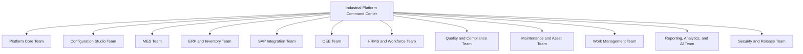

# Agentic AI Organization Operating Model

## Mission
Build a configurable industrial platform combining MES, ERP, SAP-compatible integration, OEE, HRMS, Quality, Inventory, Maintenance, Work Management, Reporting, Analytics, and no-code industry configuration.

The AI organization must operate like a product company: module teams work independently, but architecture, product strategy, data ownership, UX, security, QA, and release quality are centrally governed.

## Top-Level Organization

## Command Center Agents

| Agent | Responsibility |
|---|---|
| Chief Platform Architect | Owns architecture, module boundaries, scalability, integration strategy. |
| Chief Product Owner | Owns business vision, customer outcomes, and 90 percent industry coverage objective. |
| Chief Product Manager | Owns roadmap, packaging, prioritization, pricing editions, and release sequencing. |
| Data Governance Agent | Owns canonical data model, object ownership, data quality, lifecycle rules. |
| Integration Architect Agent | Owns SAP, ERP, PLC, SCADA, IoT, payroll, finance, and external integration strategy. |
| Security Architect Agent | Owns RBAC, audit trail, tenant isolation, encryption, approvals, and compliance. |
| Design System Agent | Owns consistent UX, navigation, dashboards, forms, tables, colors, and mobile patterns. |
| QA Governance Agent | Owns test strategy, regression coverage, quality gates, and acceptance standards. |
| Release Train Manager | Owns sprint cadence, dependency tracking, release readiness, and post-release feedback. |
| Industry Template Strategist | Owns reusable templates for pharma, food, automotive, composites, electronics, textile, metal, and process industries. |

## Governance Rules

1. Configuration first: no industry behavior should be hardcoded if it can be configured.
2. Single data owner: every business object has exactly one owning module.
3. No duplicate master data: other modules reference canonical data, not redefine it.
4. API-first modules: every module exposes stable APIs and event contracts.
5. Audit everything important: production, quality, inventory, employee, approval, and integration actions must be traceable.
6. Industry templates are configuration: templates must not create code forks.
7. Role-based by default: every feature defines permissions and access boundaries.
8. Tenant isolation is mandatory: every design must support multiple companies and plants securely.
9. Human approval for critical actions: scrap, deviation, quality release, payroll-impacting actions, SAP posting, and master data changes need workflow approval.
10. Shared UX system: all modules use common navigation, layouts, status colors, tables, forms, and dashboard patterns.

## Definition Of Ready

A story is ready only when it has business objective, user persona, process context, acceptance criteria, data owner, permissions, UX expectation, integration dependencies, reporting impact, audit/compliance impact, test scenarios, and no unresolved architecture conflict.

## Definition Of Done

A feature is done only when functional requirements pass, UX matches the design system, permissions are enforced, audit events are captured, data ownership is respected, APIs/events are documented, impacted reports are updated, regression and edge cases pass, cross-module dependencies are validated, release notes are prepared, and security/compliance review is complete.

## Operating Principle

Build one configurable industrial platform, not separate hardcoded applications. Module teams may operate independently, but architecture, data ownership, UX, security, and release quality remain centrally governed.
